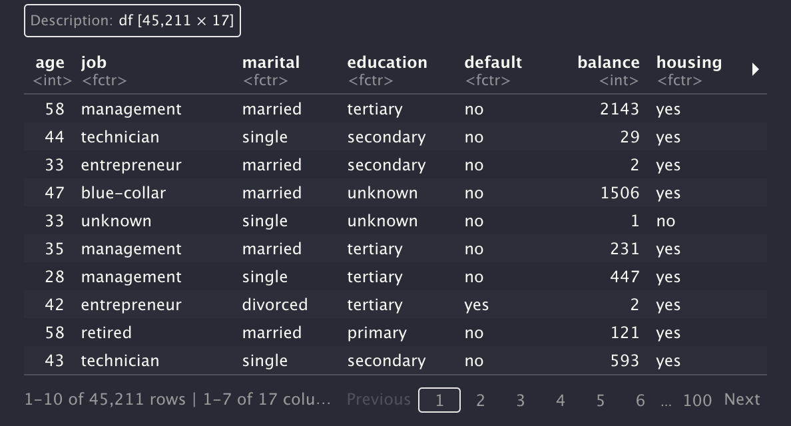

```{r setup, include=FALSE}
knitr::opts_chunk$set(echo = FALSE)
```

```{r libraries, message=FALSE, warning=FALSE}
library(tidyverse)
library(tidymodels) 
library(skimr)

bank_df <- 
  read.csv('bank-full.csv', sep=';') %>% 
  mutate_if(is.character, as.factor)

```

R is the introductory programming language in my journey of learning
data science, and I love using it for exploratory analysis, to plot
graphs, or clean data. This is mainly due to the variety of convenient
tools in the [`tidyverse`](https://www.tidyverse.org) packages. However,
Python is my go-to for anything related to building predictive models
and machine learning. During my last internship, R was the main program
that we used for data related projects and that's where I started to
pick up R for machine learning.

Recently I've stumbled upon the
[`tidymodels`](https://www.tidymodels.org) library, which is a
collection of packages for modeling and machine learning...the tidy way.
I wanted to write a series of posts sharing what I learned from each
library by showing examples of use cases and code snippets, along with
explaining some technical terms along with way. We will start off with
the `samplr` package.

Here's what we'll focus on :

1.  [**The `rsample` library**](#rsamplelib)

    -   Intro to `rsample`
    -   Installation

2.  [**Overview on resampling methods**](#overview)

    -   What is resampling?
    -   Why does it matter?

3.  [**The dataset**](#data)

4.  [**`rset` vs. `rsplit` objects**](#objects)

5.  [**Split training and testing sets**](#init_split)

    -   `initial_split()`
    -   `initial_time_split()`
    -   `training()`, `testing()`

6.  [**Bootstrapping**](#boots)

    -   `bootstraps()`

7.  [**Cross Validation**](#c_val)

    -   V-fold Cross-Validation (K-fold Cross-Validation) - `vfold_cv()`

## The rsample library {#rsamplelib .unnumbered}

### Intro to `rsample`

The [`rsample`](https://rsample.tidymodels.org/index.html) package
contains functions that help split the data into different sample sets
for analysis using **resampling** methods. Before we talk about
resampling methods, let's start with installing the package.

### Installation

You can get the `samplr` package by installing the `tidymodels`
meta-library:

```{r installation1, eval=FALSE, echo=TRUE}
# Install from CRAN
install.packages("tidymodels")
```

```{r installation2, eval=FALSE, echo=TRUE}
# Install from GitHub
install.packages("devtools")
library(devtools)
install_dev("tidymodels")
```

Or just the `rsample` package:

```{r installation3, eval=FALSE, echo=TRUE}
# Install from CRAN
install.packages("rsample")
```

```{r installation4, eval=FALSE, echo=TRUE}
# Install from GitHub
install.packages("devtools")
library(devtools)
install_dev("rsample")
```

Then load in the libraries that we'll be using:

```{r load libraries, eval=FALSE, echo=TRUE}
# Load in the libraries
library(rsample)
library(tidyverse)
```

Now that we've installed and loaded the packages, let's go over some
terms related to resampling.

## Overview on resampling methods {#overview .unnumbered}

### What is resampling?

To simply put, [**statistical resampling**](https://en.wikipedia.org/wiki/Resampling_(statistics)) is drawing a sample set from the available data, measure the statistics(mean,
standard deviation, etc.) on the sample then repeating the process x
amount of times. This repeated process tells us a better estimation about the statistics of the population. It becomes useful when we have a small sample data.  

In *machine learning*, we use resampling to test the performance of a
model. For example, [**Bootstrapping**](https://en.wikipedia.org/wiki/Bootstrapping_(statistics)) is a method of resampling where we randomly draw the same size of sample from the original data *with* replacement (observation can occur more than once in the sample set). This becomes
the training set for the model, and the remaining set that wasn't drawn would be used for testing the model. In contrast, **Cross-Validation** is when the
data is drawn randomly *without* replacement. We will look at different
Cross-Validations with examples later in the post.

### Why does it matter?

Due to the nature of randomness, a model could be trained on a set of
data with bias or a certain skewness that doesn't represent the original
data set. Or the model could be excellent at predicting on one specific
testing set sample. This could lead to false conclusions about the model
performance. To avoid making invalid conclusions, it's important to take
time to validate your sample.

The **downside of resampling** could be how computationally expensive it
gets with the amount of resamples and iterations of the analysis.

I would recommend further study on resampling methods as I haven't
gotten into much depth. [Check out this article on
Resampling
Methods](https://towardsdatascience.com/data-science-simplified-part-12-resampling-methods-e029db77fa9c).

## The dataset {#data .unnumbered}

We'll use the [Bank
Marketing](https://archive.ics.uci.edu/ml/datasets/Bank+Marketing)
dataset -- a direct marketing campaign of making phone calls to clients
for subscription to a term deposit. Here's what our data look like:

```{r read_data, echo=T, eval=F}
# Read in dataset
bank_df <- 
  read.csv('bank-full.csv', sep=';')
```



There are 45,211 rows and 17 columns in the dataset. Let's check for any
missing values:

```{r echo=TRUE}
# Total missing values
bank_df %>% 
  is.na() %>% 
  sum()
```

There are 0 missing values. Let's check the balance of the target
variable column to see what percentage of the clients subscribed to the
term deposit using the column "`y`":

```{r echo=TRUE}
# Check target variable proportion
bank_df %>% 
  count(y) %>% 
  mutate(prop = n/sum(n))
```

About 11% of the phone calls had a successful outcome of the client
agreeing on a subscription. Luckily the data seems relatively clean and
doesn't include any missing data. We will work on some exploratory work
on a different article. For now, let's get familiar with some `rsample`
functions and use cases.

## `rset` vs. `rsplit` objects {#objects .unnumbered}

The `rsample` package uses `rset` and `rsplit` class objects that are derived from different methods of splitting data sets. **`rset`** objects are a [`tibble`](https://tibble.tidyverse.org) object that contains a collection of resamples. Each resamples are stored as an `rsplit` object in the `splits` column of the `rset` object.


ADD DRAWING

## Split training and testing sets {#init_split .unnumbered}

Let's create our training and testing data sets using the
[`inital_split()`](https://rsample.tidymodels.org/reference/initial_split.html) function. The `prop` argument defines the split proportion which in our case training set will contain 80% of the original data to train the model, while remaining 20% set will be used to check the model performance. 

```{r split_data}
# define split method
data_split <- initial_split(data = bank_df, prop = .8)
```

Once we define our split, we use the `training()`, `testing()` functions to extract the data and assign to variables. 

```{r}
# assign training and testing sets
train <- training(data_split)
test <- testing(data_split)

```

Notice the `initial_split()` function classifies the splits as `Analysis`, `Assessment`. This is the same as the train and test split but since we already have  `training()` and `testing()` functions, it uses `Analysis` and `Assessment` to avoid confusion. 

```{r}
data_split
```

## Bootstrapping with rsample {#boots .unnumbered}

As we mentioned earlier that bootstrapping samples the data set with replacements. The analysis set may contain data with repeated samples, and the assessment set included data that weren't part of the analysis set. It uses the function [`bootstraps()`](https://rsample.tidymodels.org/reference/bootstraps.html), which returns a tibble with the amount of samples defined in the `times` argument. Below we have a `rset` object containing 4 `rsplit` objects with [# of analysis samples/# of assessment samples]. Notice that the analysis sample size is the same as the original data size, and the assessment sample sizes vary. 


```{r echo=FALSE}
bootstrap_samples <- bootstraps(bank_df, times=4)
```

```{r bootstrap, echo=TRUE}
# Bootstrap sampling with 4 sample sets
bootstrap_samples <- bootstraps(bank_df, times=4)
bootstrap_samples
```


In order to extract the analysis and assessment samples we would define it the `data` parameter:

```{r first_resample, echo=TRUE}
# select the bootstrap sample by index
# in this case we'll select the first resample
first_resample <- bootstrap_samples$splits[[1]]

# extract the analysis
first_resample_analysis <- as.data.frame(first_resample, data='analysis')
# extract the assessment
first_resample_assessment <- as.data.frame(first_resample, data='assessment')
```


## Cross-Validations with rsample {#c_val .unnumbered}

### V-fold Cross-Validation (K-fold Cross-Validation)

V-fold (also known as K-fold) Cross-Validation is when we split the data into "v" number of equal groups. For example, when v=10, then we have a 10-fold cross-validation. If we have a 10-fold cross-validation, the data is split into 10 almost equal sets. We pick the first group for evaluating our model and use the remaining 9 groups to train the model. We repeat the process until each group gets to be used as a test set. This resampling method is used widely in machine learning due to how well it could measure a model's performance by reducing the bias in the data. It's also a great way to tune the hyperparameters of the model.

Lets try it out using the `vfold_cv()` function:

```{r, echo=TRUE}
vfold <- vfold_cv(bank_df, v = 10)
vfold
```

## Summary

We went over some resampling methods and apply them by using rsample library. In the following series, we’ll go over some more tidymodels libraries and also see how these functions are applied in model development and assessing model performance. 


